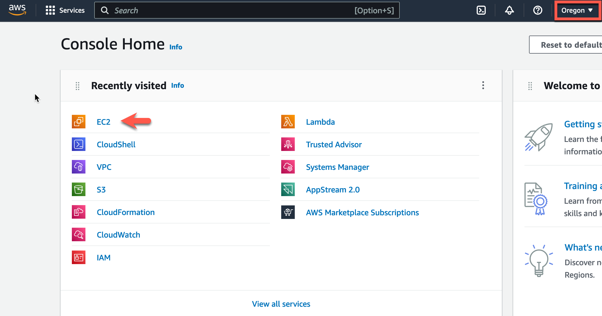
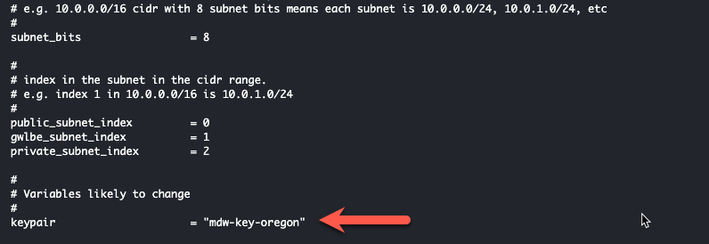
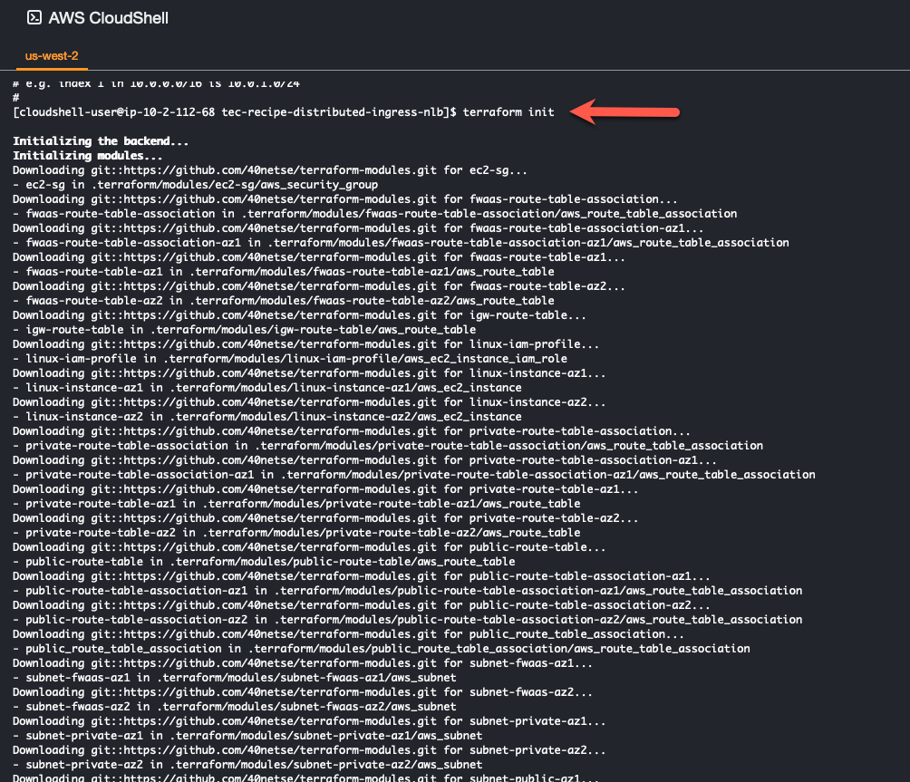
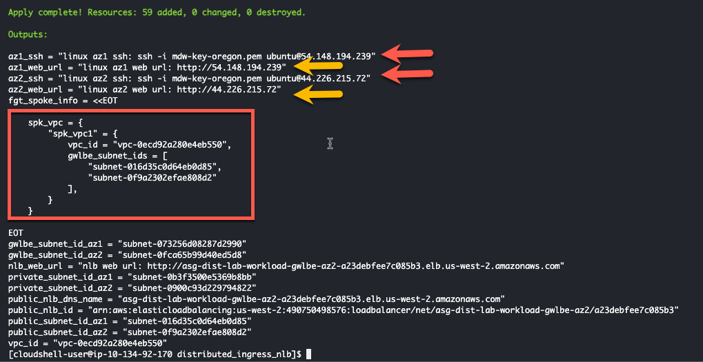
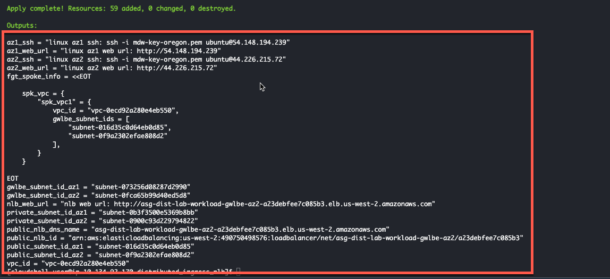

* Log into your AWS account and navigate to the [**Console Home**](https://us-west-2.console.aws.amazon.com/console/home?region=us-west-2#).

{}
**Note:** Make sure you are running this workshop in the intended region. The defaults are configured to run this workshop in us-west-2 (Oregon). Make sure your management console is running in us-west-2 (Oregon), unless you intend to run the workshop in a different FortiGate CNF supported region.
{}


* Click on the AWS CloudShell icon on the console navigation bar


* Clone a repository that uses terraform to create a distributed ingress workload vpc

  ``` git clone https://github.com/FortinetCloudCSE/FortiGate-AWS-Autoscale-TEC-Workshop.git ```

* Change directory into the newly created repository for distributed_ingress_nlb

  ``` cd FortiGate-AWS-Autoscale-TEC-Workshop/terraform/distributed_ingress_nlb ```
  
* Copy the terraform.tfvars.example to terraform.tfvars

  ``` cp terraform.tfvars.example terraform.tfvars ```
  


* Edit the terraform.tfvars file and insert the name of a valid keypair in the keypair variable name and save the file

{}
**Note:** Examples of preinstalled editors in the Cloudshell environment include: vi, vim, nano
{}

{}
**Note:** AWS Keypairs are only valid within a specific region. To find the keypairs you have in the region you are executing the lab in, check the list of keypairs here: AWS Console->EC2->Network & Security->keypairs. 
This workshop is pre-configured in the terraform.tfvars to run in the us-west-2 (Oregon) region. 
{}




{}
**Note:** You may change the default region in the terraform.tfvars file to another FortiGate CNF supported region if you don't have a valid keypair in that region and you don't want to create one for this workshop.
{}



* Use the "terraform init" command to initialize the template and download the providers

  ``` terraform init ```



* Use "terraform apply --auto-approve" command to build the vpc. This command takes about 5 minutes to complete.

``` terraform apply --auto-approve ```


* When the command completes, verify "Apply Complete" and valid output statements.
  * Make note of the Web Url (red arrow) for each instance and for the NLB that load balances between the Availability Zones.
  * Make note of the ssh command (yellow arrow) you should use to ssh into the linux instances.
  * Make note of the spk_vpc section of the output. This will be used as input to the autoscale templates. This defines the vpc id of the distributed workload vpc and the subnet_ids for the gwlb endpoints.
  * Bring up a local browser and try to access the Web Url. 
  * Copy the "Outputs" section to a scratchpad. We will use this info throughout this workshop.





The network diagram for the distributed ingress vpc looks like this:


* This concludes this section.
