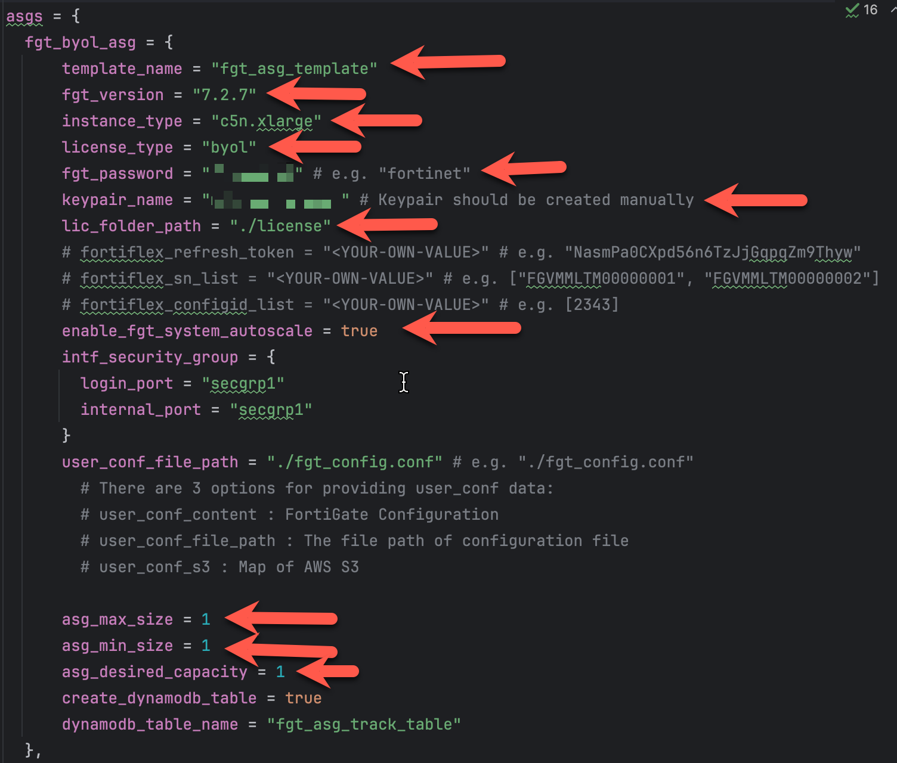
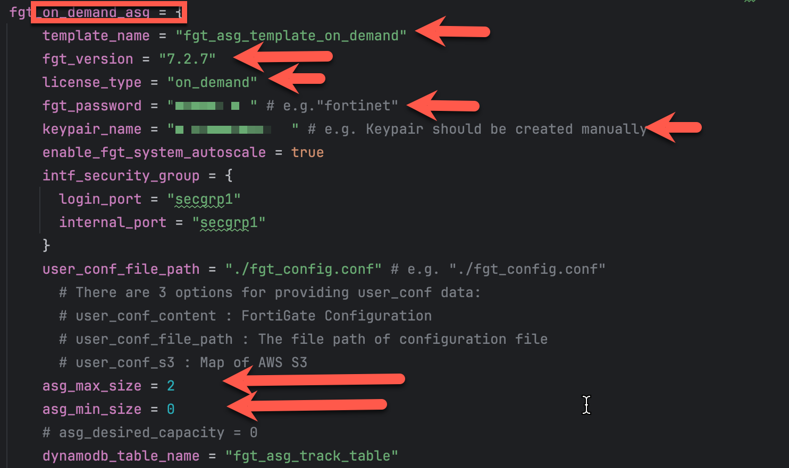
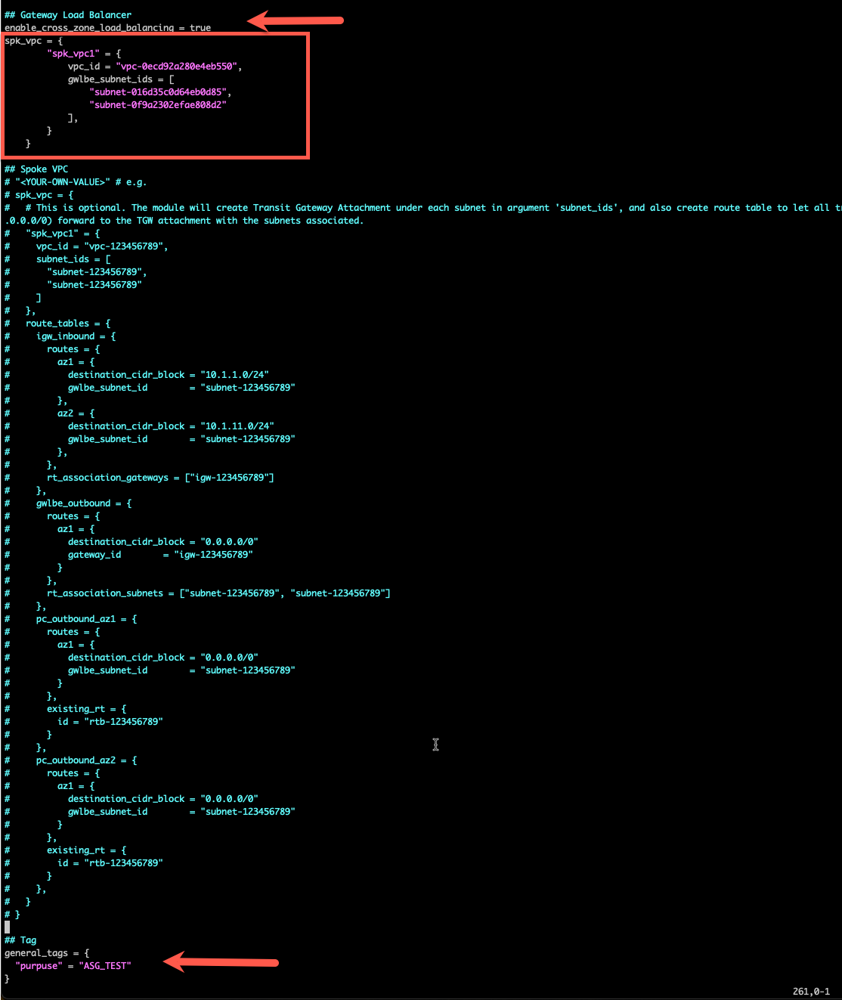

* This task will deploy a FortiGate Autoscale group and install gateway load balancer endpoints (GWLBe) in the appropriate subnets of the distributed ingress workload vpc. Unfortunately, we will not be able to deploy the FortiGate Autoscale Group template from within AWS Cloudshell due to the 1GB disk space limitation of Cloudshell. If you take a look at the network diagram of the distributed ingress workload vpc, you will see that a linux ec2 instance was deployed in AZ1 with a public EIP address. This public IP address should be in the output of the template and you should have this saved in your scratchpad that was saved in the previous task. This ec2 instance is preconfigured with terraform and we will use this instance to clone and deploy the FortiGate Autoscale Group. 


* ssh into the Linux instance in AZ1 using the command in your scratchpad.

  ``` ssh -i <keypair> ubuntu@<public-ip> ```


* First task is to provide the ec2 instance with your AWS account credentials. This will provide the necessary permissions to run the autoscale terraform templates. 
  * from the command line, run the aws configure and enter your access key, access secret, default region, and preferred output (text, json).
  
  ``` aws configure ```
  


* The ec2 instance has been pre-configured to export your AWS credentials into the login environment variables. If you would like to investigate the specifics, see the web-userdata.tpl file in the config_templates directory of the templates we deployed in task 2. In order to export the credentials, we will need to logout and login again. Please check the values for the proper credentials.

    ``` exit ```

    ``` ssh -i <keypair> ubuntu@<public-ip> ```

    ``` env ```


* Clone build 11 of the autoscale templates repository that uses terraform to create a distributed ingress workload vpc.

  ``` git clone https://github.com/fortinetdev/terraform-aws-cloud-modules.git ```

* Change directory into the newly created repository and move to the examples/spk_gwlb_asg_fgt_gwlb_igw directory. This directory will deploy a Fortigate Autoscale group with a Gateway Load Balancer and gateway load balancer endpoints in the appropriate subnets of the distributed ingress workload vpc. 

  ``` cd terraform-aws-cloud-modules/examples/spk_tgw_gwlb_asg_fgt_igw ```
  
* Copy the terraform.tfvars.example to terraform.tfvars

  ``` cp terraform.tfvars.txt terraform.tfvars ```
  


* Edit the terraform.tfvars file. If you are not using AWS Cloudshell, then I recommend exporting your AWS credentials into your environment and not hard-coding your credentials into the terraform.tfvars file. You can find more information here: https://docs.aws.amazon.com/cli/latest/userguide/cli-configure-envvars.html

{}
**Note:** You can find more information on exporting your AWS credentials into your environment here: https://docs.aws.amazon.com/cli/latest/userguide/cli-configure-envars.html
{}

{}
**Note:** Examples of preinstalled editors in the Cloudshell environment include: vi, vim, nano
{}

{}
**Note:** This task will create a Fortigate Autoscale deployment suitable for a customer demo environment. This environment is complete with a Transit Gateway (TGW) and complete spoke VPC's.
{}

{}
**Note:** Documentation for the template variables can be found here: https://github.com/fortinetdev/terraform-aws-cloud-modules/tree/main/examples/spk_tgw_gwlb_asg_fgt_igw
{}

* This workshop will assume your access_key and secret_key are already exported into your environment. Remove the "access_key" and "secret_key" lines and fill in the "region" you intend to use for your deployment.


* Fill in the cidr_block you want to use for the inspection VPC. 
* Fill in the cidr_block you want to use for each spoke_vpc. Create  the spoke_cidr_list as a terraform list. 
* Create a terraform list for the set of availability_zones you want to use.


* Fill in the desired fgt_intf_mode. 1-arm mode uses a single Fortigate ENI and hairpins the traffic in and out of the same ENI. 2-arm mode uses two Fortigate ENIs and allows for a more traditional routing configuration via a public and private interface. 
* This workshop will use the 2-arm mode. 


* Each Fortigate Autoscale deployment using standard BYOL and PayGo licensing will create 2 autosclale groups. The BYOL autoscale group will use the BYOL licenses found in the license directory. If more instances are needed to handle the load on the autoscale group, Fortigate Autoscale will scale-out using PayGo instances if all BYOL licenses are consumed. Lets fill in the BYOL section of the template.
* Fill in the byol section with values for the highlighted variables:
  * template_name = anything
  * fgt_version = desired fortios version
  * license_type = leave as byol
  * fgt_password = desired fortigate password when logging into the fortigate
  * keypair_name = keypair used for passwordless login
  * lic_folder_path = path to Fortigate byol licenses
  * asg_max_size = maximum number of instances in the autoscale group
  * asg_min_size = minimum number of instances in the autoscale group
  * asg_desired_capacity = desired number of instances in the autoscale group
  * leave the rest of the variables as is
  
  

* Fill in the on_demand (PayGo) section with values for the highlighted variables:
  * template_name = anything
  * fgt_version = desired fortios version
  * license_type = leave as on-demand
  * fgt_password = desired fortigate password when logging into the fortigate
  * keypair_name = keypair used for passwordless login
  * asg_max_size = maximum number of on-demand instances in the autoscale group
  * asg_min_size = minimum number of instances in the autoscale group
  * asg_desired_capacity = desired for paygo is meaningless. The on-demand will only scale as a result of an autoscale event. 
  * leave the rest of the variables as is
  
* The scale policies control the scaling of the autoscale groups. The scale policies are based on the average CPU utilization of the autoscale group. The scale policies are set to scale out when the average CPU utilization is greater than 80% and scale in when the average CPU utilization is less than 20%. The scale policies are set to scale out and in by 1 instance. This workshop will leave the scaling policies as is.


  

* Set enable_cross_zone_load_balancing to true. This will allow the Gateway Load Balancer to distribute traffic across all instances in all availability zones.
* Copy the spk_vpc section from your scratchpad and paste it into the tfvars file.
* Set general_tags to anything you like. Each resource created by the template will have these tags.
* As you can see in the example tfvars file, there are many options (commented out) for configuring the route tables in the security vpc and the spoke vpcs. However, these will not work for the distributed_ingress VPC because the original template created the necessary routes to make this a "working" vpc. The autoscale template is not able to "modify" the existing routes. Therefore, this workshop will only deploy the gwlb endpoints via the template and we will manually modify the route tables in a later task.


  

* Use the "terraform init" command to initialize the template and download the providers

  ``` terraform init ```


* Use "terraform apply --auto-approve" command to build the vpc. This command takes about 5 minutes to complete.

``` terraform apply --auto-approve ```

* When the command completes, verify "Apply Complete" and valid output statements.


The network diagram for the FortiGate Autoscale Security VPC with the distributed ingress vpc with GWLB endpoints deployed looks like this:


* This concludes this section.


